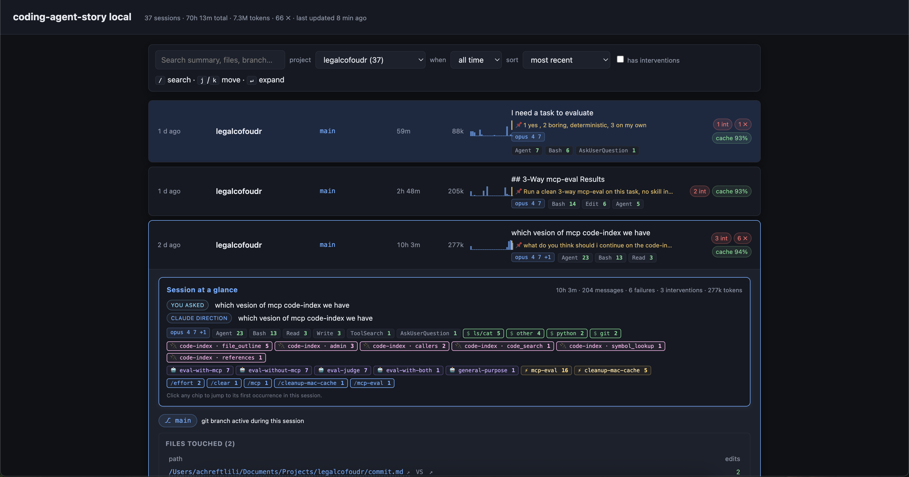

# Coding Agent Story

Turn Claude Code transcripts into readable PR stories — locally.



`castory` reads the JSONL transcripts that Claude Code already writes to
`~/.claude/projects/` and renders three views over them:

- **dashboard** — every session you've ever run, filterable & searchable
- **session** — one conversation replayed as decisions / interventions / edits
- **PR** — sessions on a branch consolidated into paste-ready markdown

All processing happens on your machine. There are **no network calls** and
**no LLM calls** in the default codepath.

## Install

```sh
npm install -g @achreftlili/castory
```

Or run with no install:

```sh
npx @achreftlili/castory@latest dashboard
```

Requires Node ≥ 20.

For development against the source tree, use `npm link`:

```sh
git clone https://github.com/achreftlili/CA-story.git castory && cd castory
npm link    # `castory` now resolves to your working copy
```

## Quick start

```sh
castory dashboard           # build + open in your browser
castory list                # plain-text list of every session
castory session <id>        # render a single session as HTML
castory pr --branch foo     # consolidate sessions on a branch into a PR
castory share               # commit this branch's sessions for reviewers
castory dashboard --serve   # local server with 30s auto-refresh
```

## Share sessions with reviewers

When you open a PR, reviewers usually only see the diff. With `castory share`
you can commit the Claude sessions that produced the diff to the branch, so
anyone reviewing can replay the work locally:

```sh
# On the author's machine, with the feature branch checked out:
castory share              # copies branch sessions → .castory/sessions/<id>.jsonl
                           # writes .castory/manifest.json
                           # stages + commits the files
git push
```

Then on the reviewer's machine, after pulling the branch:

```sh
castory dashboard          # auto-discovers .castory/sessions in the repo
                           # branch sessions show up with a "shared" badge
```

Useful flags:

- `--branch NAME` — share a branch other than the current HEAD
- `--no-commit` — copy + stage but let the user do the commit
- `--dry-run` — print what would happen, write nothing

> **Heads-up on privacy.** Claude transcripts can contain anything you pasted —
> file paths, command output, secrets, internal-only context. Open the staged
> JSONL files before pushing to a public repo.

## Commands

| Command                              | What it does                                         |
|--------------------------------------|------------------------------------------------------|
| `castory list`                       | Print discovered sessions across all projects        |
| `castory list --json`                | Same, machine-readable                               |
| `castory session <id>`               | Render one session as HTML to stdout                 |
| `castory session <id> --out PATH`    | Write HTML to `PATH`                                 |
| `castory pr --branch <name>`         | Consolidate sessions on a branch into PR markdown    |
| `castory pr --branch foo --repo .`   | Look in a specific repo for the branch's commits     |
| `castory share`                      | Commit this branch's sessions to `.castory/` for reviewers |
| `castory share --no-commit`          | Stage the files but let the user commit              |
| `castory share --dry-run`            | Print what would happen, write nothing               |
| `castory dashboard`                  | Build the dashboard and open it in your browser      |
| `castory dashboard --out PATH`       | Write the dashboard HTML to `PATH`, don't open       |
| `castory dashboard --serve`          | Start a local server with auto-refresh               |
| `castory dashboard --serve --port N` | Start the server on a specific port (auto-increments if busy) |
| `castory dashboard --projects A,B`   | Restrict to specific project paths                   |
| `castory --version` / `--help`       | Standard CLI flags (each subcommand has its own `--help`) |

## What it extracts

Each session is parsed into events:

- **decisions** — assistant statements of intent ("I'll …", "Let me …")
- **forks** — the assistant offering you a choice
- **interventions** — your steering message after a fork or correction
- **actions** — `Edit` / `Write` / `Bash` tool calls
- **outcomes** — tool results

Events are grouped into chapters by file proximity and idle gaps (>5 min).
For PR consolidation, actions are deduped by `(file_path, tool, command)`
and decisions by token-set similarity > 0.85. **Every intervention is
preserved verbatim** — those are the highest-signal moments in a session.

## Privacy

- All data stays on your machine.
- No network calls in the default codepath. Verify in DevTools: opening the
  dashboard makes **zero** outbound requests.
- No LLM calls. Summaries are extracted strings from your transcript.
- Cache lives at `~/.cache/castory/` — delete it any time.

## Uninstall

```sh
npm uninstall -g @achreftlili/castory
rm -rf ~/.cache/castory
```

## Development

```sh
npm test            # unit + integration tests
npm run test:e2e    # playwright headless smoke (requires `npx playwright install chromium` once)
```

No runtime npm dependencies — everything is Node stdlib. Playwright is the
only dev dependency.

## Schema reference

See [`docs/transcript-schema.md`](docs/transcript-schema.md) for the
verbatim Claude Code JSONL schema this tool reads.
